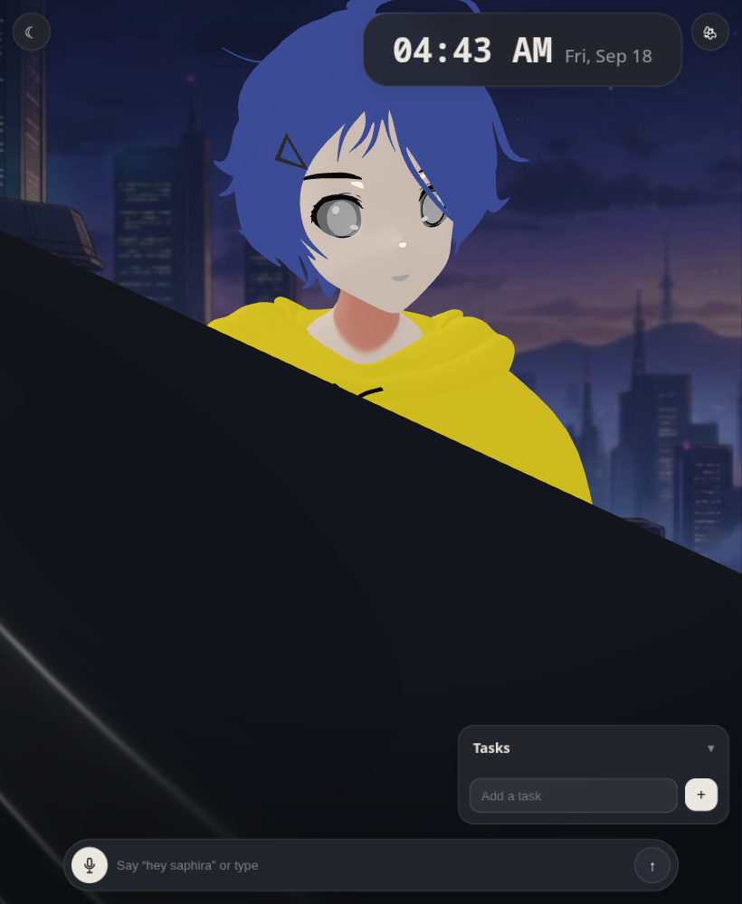
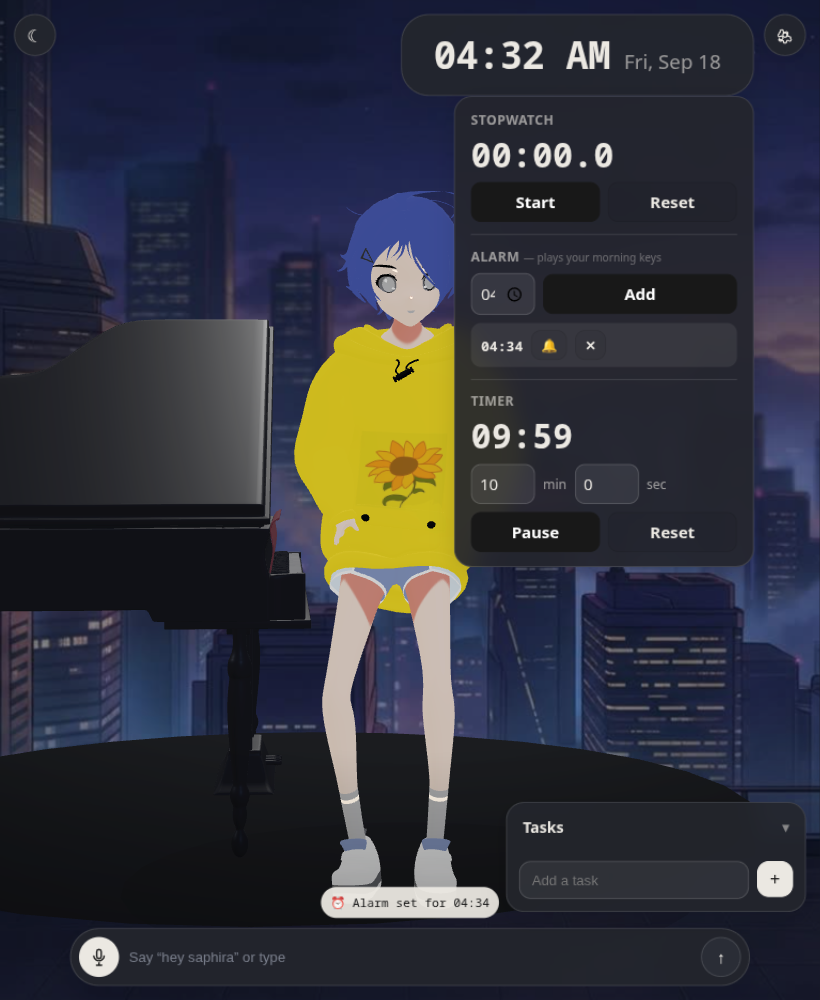
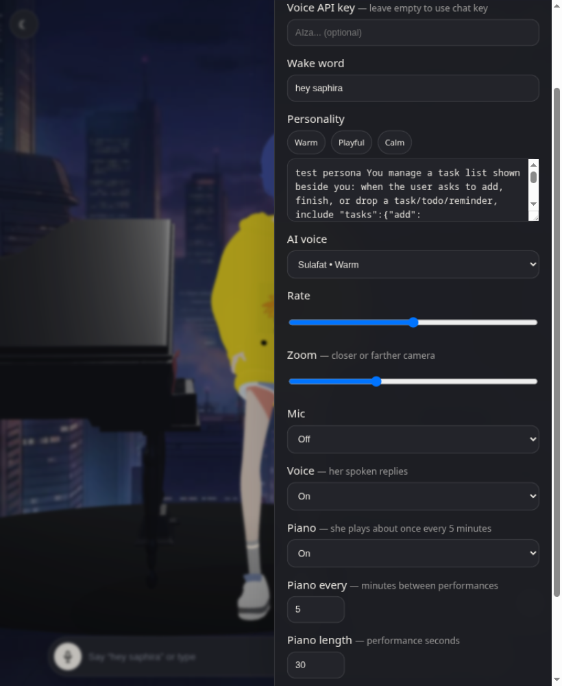

# Saphira Air — iPad Air (2013) edition

Saphira — a night-city companion with a grand piano. Now runs on a 2013 iPad Air.

> Main build targets modern browsers. **Air** is the same character, same scenes, same chat — tuned so iOS 12 / Safari 12 / WebGL 1 / 1GB RAM doesn't fall over. No separate lite model, no stripped features — just graceful degradation where the hardware demands it.




## What she does

- **Talks** — Gemini chat with spoken replies (Gemini TTS → browser voice fallback), personality presets, wake word on desktop, tap-to-talk on iOS.
- **Plays the grand piano** — every few minutes she strolls to the case and performs for ~30 seconds. Three original tunes (lullaby, nocturne, music-box waltz), picked at random. Interval and length are adjustable in settings.
- **Keeps time for you** — click the clock: a stopwatch, a countdown timer, and wake-up alarms that play a soft morning-keys track.
- **Controls it all by chat** — *"set a timer for 10 minutes"*, *"cancel the timer"*, *"wake me at 7:30"*, *"remove my alarm"*, *"what alarms do I have"*, *"add milk to my tasks"* — she drives the real UI through JSON ops.
- **Lives in the scene** — wanders the rooftop, glances around, yawns, follows your gaze, day/night lighting, night-city backdrop in both themes.



| Control | Where |
|---|---|
| Chat / voice in | bottom pill + mic |
| Piano on/off, every N minutes, length | ⚙ → Piano |
| Voice on/off | ⚙ → Voice |
| Idle chatter on/off + interval | ⚙ → Idle chatter |
| Stopwatch / Timer / Alarms | click the clock |
| Personality, AI voice, rate, zoom | ⚙ |



---

## What changed for Air

Single adaptive build — modern browsers get 100%, the Air auto-switches via `html.legacy` (set before first paint in `index.html`).

| Area | Main | Air (`isLegacy`) | File |
|---|---|---|---|
| JS target | `es2022` | `es2015` + `cssTarget:ios12` — Safari 12 can parse it | `vite.config.ts` |
| Renderer | `antialias:true`, `dpr 1.6`, `AgXToneMapping` | `antialias:false`, `dpr 1`, `NoToneMapping` fallback | `src/avatar.ts` |
| Textures | anisotropy default | `anisotropy:1`, `LinearFilter` | `src/avatar.ts` |
| Ground segments | 32/28 | 20/16 | `src/avatar.ts` |
| Mood light | breathing PointLight + bg lerp | snap + decay (no per-frame sin) | `src/avatar.ts` |
| Animate | 60fps | ~30fps throttle on A7 | `src/avatar.ts` |
| Blur | `backdrop-filter:blur(12px)` everywhere | `html.legacy` forces solid `rgba` — Air composite can't do blur | `src/style.css` |
| Audio | `AudioContext({24000})` | `webkitAudioContext` + 44100 fallback, resamples PCM | `src/aiVoice.ts` |
| Voice-in | continuous wake word (`hey saphira`) | tap-to-talk only — iOS Safari never shipped `SpeechRecognition` | `src/speech.ts` |

Kept: the same character model, the full clip set **plus a 30-second piano performance** (3 melodies), foot-clamp grounding + Hips pin (every clip plays planted on the disc), wandering with piano-avoidance routing, head-track, random gaze on touch, blink, breathing, face-zoom, tasks, day/night, Gemini chat + TTS. Piano melodies and all speech unlock their audio on the first tap (iOS 12 gets touch-event unlocks — it never fires pointer events).

## Quick start

```bash
npm install
npm run dev        # http://localhost:5173
npm run build      # tsc + vite build → dist/
npm run preview    # serve dist/
```

## Deploy to Vercel

This repo is ready for Vercel zero-config — it runs `npm run build` and serves `dist/`.

1. Fork / push this repo (already at `touhidsiddiqueeraj-bit/Saphira-Air`).
2. Vercel → **Add New Project** → import `Saphira-Air`.
3. Framework preset: **Vite**. Build command `npm run build`, output `dist`.
4. Add env vars if you want baked-in keys (optional):
   - `VITE_GEMINI_KEY` — chat key
   - `VITE_GEMINI_TTS_KEY` — voice key (falls back to chat key if empty)
5. Deploy. Open the URL on the Air **over HTTPS** — mic requires secure context.

> Without env vars it still works — tap ⚙ in the app and paste keys (stored in `localStorage`).

## Setup: Gemini keys

1. Get a key at [Google AI Studio](https://aistudio.google.com/).
2. Open Saphira → ⚙ (top right):
   - **Chat API key** — Gemini flash-lite
   - **Voice API key** — TTS, leave empty to reuse chat key

Without a chat key she still renders, wanders, and plays piano — but replies ask for a key.

## Using on iPad Air 1 (iOS 12.5.7)

| Action | How |
|---|---|
| Chat | Type in bottom pill, Enter |
| Voice in | Tap mic button, speak (wake word disabled — iOS has no SpeechRecognition) |
| Voice out | Gemini TTS → falls back to iOS speech synthesis → mimes + face-zoom if both fail |
| Piano | Automatic (rare), say *"play piano"*, or the piano toggle in ⚙ |
| Timer / Stopwatch / Alarms | Click the clock — alarms play the morning-keys track |
| Personality | Settings → Personality (Warm / Playful / Calm or custom) |
| AI voice | Settings → AI voice (Sulafat, Leda, Aoede, Puck, Kore, Fenrir, Charon, Zephyr) |
| Day / night | ☀/☾ button or Auto (07–19 day) — the city backdrop stays in both |

Tip: **Add to Home Screen** from Safari for fullscreen, then launch from the icon.

## Architecture

```
index.html            app shell, legacy sniff before paint
vite.config.ts        target es2015, cssTarget ios12
src/
  main.ts             UI, clock tools (timer/stopwatch/alarms), chat ops
  avatar.ts           three.js scene, piano staging, detectLegacy() + WebGL1 fallbacks
  pianoSong.ts        WebAudio music box — 3 melodies for the piano performances
  gemini.ts           Gemini flash-lite, RPM throttle, 429 backoff, JSON ops parse
  aiVoice.ts          Gemini TTS (PCM) → AudioContext fallback
  speech.ts           Web Speech (iOS stubbed → tap-to-talk)
  settings.ts         localStorage persistence + persona suffixes (tasks/clock ops)
  style.css           html.legacy kills backdrop-filter; night-city backdrop
public/
  model/ai_ohto.glb   character
  model/piano.glb     grand piano prop
  model/anim_piano.glb piano performance clip (retargeted at runtime)
  bg.jpg              night-city backdrop
  audio/good-morning.mp3  alarm track
```

Rendering notes: `NoToneMapping` fallback is fine because skin/hoodie materials are `toneMapped:false`. The look stays emissive/cel-shaded even without AgX. The stage background is a CSS photo layer — the canvas renders transparent over it, and the rug disc under her feet is the only floor geometry.

## Limitations

- **Wake word doesn't exist on iOS** — not a bug, Apple never shipped the API. Tap-to-talk is the native path (`src/speech.ts`).
- **Mic needs HTTPS** — `http://` will silently fail on iOS. Vercel gives you HTTPS.
- **Free-tier quotas** — Gemini chat/TTS 429s show "Busy — try again in a bit." and auto-fallback to local voice.
- **First tap unlocks audio** — iOS suspends WebAudio until a gesture; piano melodies start after your first tap on the page.
- **If the model OOMs** (rare on Air 1), open an issue — next step is a Draco + 512px legacy GLB. Not shipped yet to keep her visually identical.

## Credits

Saphira model: Mixamo-rigged `saphira_mixamo_rigged.blend` → `ai_ohto.glb` (33-bone `mixamorig:`). Grand piano: rebuilt from a stock 3ds-Max piano FBX, rescaled and restyled. Night-city backdrop and morning-keys track: user-supplied. Main repo: `/touhidsiddiqueeraj-bit/Saphira` (if you have one).
