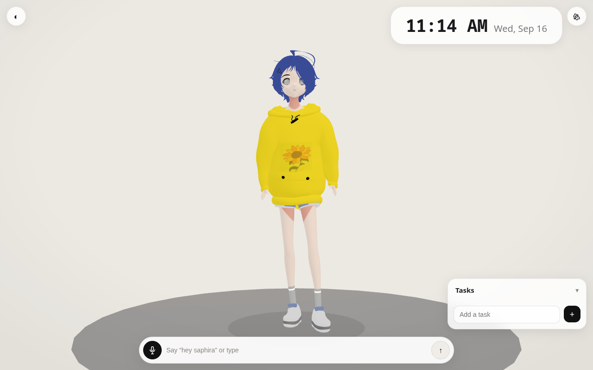
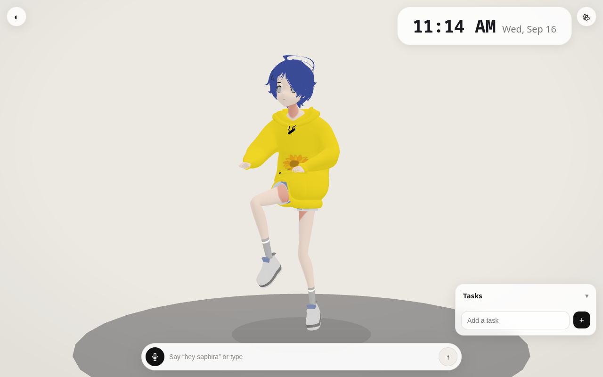
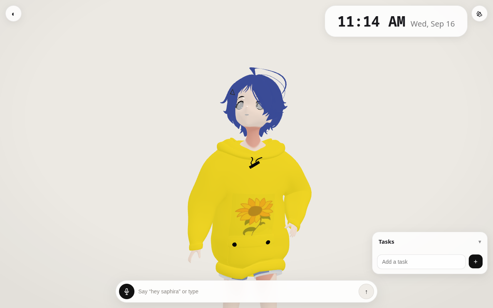

# Saphira Air — iPad Air (2013) edition

Same Saphira. Now runs on a 2013 iPad Air.

> Main build targets modern browsers. **Air** is the same character, same animations, same chat — tuned so iOS 12 / Safari 12 / WebGL 1 / 1GB RAM doesn't fall over. No separate lite model, no stripped features — just graceful degradation where the hardware demands it.





**Live demo:** deploy this repo to Vercel (see below) → open on the Air over HTTPS.

---

## What changed for Air

Single adaptive build — modern iPads get 100%, the Air auto-switches via `html.legacy` (set before first paint in `index.html:6`).

| Area | Main | Air (`isLegacy`) | File |
|---|---|---|---|
| JS target | `es2022` | `es2015` + `cssTarget:ios12` — Safari 12 can parse it | `vite.config.ts:4` |
| Renderer | `antialias:true`, `dpr 1.6`, `AgXToneMapping` | `antialias:false`, `dpr 1`, `NoToneMapping` fallback | `src/avatar.ts:102-135` |
| Textures | anisotropy default | `anisotropy:1`, `LinearFilter` | `src/avatar.ts:255` |
| Ground | 32/28 segs | 20/16 segs | `src/avatar.ts:220` |
| Mood light | breathing PointLight + bg lerp | snap + decay (no per-frame sin) | `src/avatar.ts:645` |
| Animate | 60fps | ~30fps throttle on A7 | `src/avatar.ts:570` |
| Blur | `backdrop-filter:blur(12px)` everywhere | `html.legacy` forces solid `rgba` — Air composite can't do blur | `src/style.css:122`, `index.html:6` |
| Audio | `AudioContext({24000})` | `webkitAudioContext` + 44100 fallback, resamples PCM | `src/aiVoice.ts:53` |
| Voice-in | continuous wake word (`hey saphira`) | tap-to-talk only — iOS Safari never shipped `SpeechRecognition` | `src/speech.ts:28`, `src/main.ts:20-34` |

Kept: same `public/model/ai_ohto.glb` (5.1MB), all 9 clips (`idle`/`talk`/`wander`/`walk`/`wave`/`wave_small`/`nod`/`raise`/`yawn`), foot-clamp grounding + Hips pin (every clip plays planted on the disc), wandering, head-track, random gaze on touch, blink, breathing, face-zoom, tasks (bottom right), day/night, Gemini chat + TTS.

## Quick start

```bash
npm install
npm run dev        # http://localhost:5173
npm run build      # tsc + vite build → dist/
npm run preview    # serve dist/
```

## Deploy to Vercel (hosting for the Air)

This repo is ready for Vercel zero-config — it runs `npm run build` and serves `dist/`.

1. Fork / push this repo (already at `touhidsiddiqueeraj-bit/Saphira-Air`).
2. Vercel → **Add New Project** → import `Saphira-Air`.
3. Framework preset: **Vite**. Build command `npm run build`, output `dist`.
4. Add env vars if you want baked-in keys (optional):
   - `VITE_GEMINI_KEY` — chat key
   - `VITE_GEMINI_TTS_KEY` — voice key (falls back to chat key if empty)
5. Deploy. Open the URL on the Air **over HTTPS** — mic requires secure context.

> Without env vars it still works — tap ⚙ in the app and paste keys (stored in `localStorage`).

## Setup: Gemini keys

1. Get a key at [Google AI Studio](https://aistudio.google.com/).
2. Open Saphira → ⚙ (top right):
   - **Chat API key** — Gemini flash-lite
   - **Voice API key** — TTS, leave empty to reuse chat key

Without a chat key she still renders and wanders, but replies ask for a key.

## Using on iPad Air 1 (iOS 12.5.7)

| Action | How |
|---|---|
| Chat | Type in bottom pill, Enter |
| Voice in | Tap mic button, speak (wake word disabled — iOS has no SpeechRecognition) |
| Voice out | Gemini TTS → falls back to iOS speech synthesis → mimes + face-zoom if both fail |
| Personality | Settings → Personality (Warm / Playful / Calm or custom) |
| Voice | Settings → AI voice (Sulafat, Leda, Aoede, Puck, Kore, Fenrir, Charon, Zephyr) |
| Day / night | ☀/☾ button or Auto (07–19 day) |

Tip: **Add to Home Screen** from Safari for fullscreen, then launch from the icon.

## Architecture

```
index.html            app shell, legacy sniff before paint
vite.config.ts        target es2015, cssTarget ios12
src/
  main.ts             UI + Air mic hint (isLegacyIOS)
  avatar.ts           three.js scene + detectLegacy() + WebGL1 fallbacks
  gemini.ts           Gemini flash-lite, RPM throttle, 429 backoff
  aiVoice.ts          Gemini TTS (PCM) → AudioContext fallback
  speech.ts           Web Speech (iOS stubbed → tap-to-talk)
  settings.ts         localStorage persistence
  style.css           html.legacy kills backdrop-filter
public/model/ai_ohto.glb
```

Rendering notes: `NoToneMapping` fallback is fine because skin/hoodie materials are `toneMapped:false` (`src/avatar.ts:259-274`). The look stays emissive/cel-shaded even without AgX.

## Limitations

- **Wake word doesn't exist on iOS** — not a bug, Apple never shipped the API. Tap-to-talk is the native path (`src/speech.ts:28`).
- **Mic needs HTTPS** — `http://` will silently fail on iOS. Vercel gives you HTTPS.
- **Free-tier quotas** — Gemini chat/TTS 429s show “Busy — try again in a bit.” and auto-fallback to local voice.
- **If the model OOMs** (rare on Air 1 with 5.1MB), open an issue — next step is a Draco + 512px legacy GLB (~1.2MB). Not shipped yet to keep her visually identical.

## Credits

Saphira model: Mixamo-rigged `saphira_mixamo_rigged.blend` → `ai_ohto.glb` (33-bone `mixamorig:`). Main repo: `/touhidsiddiqueeraj-bit/Saphira` (if you have one).
